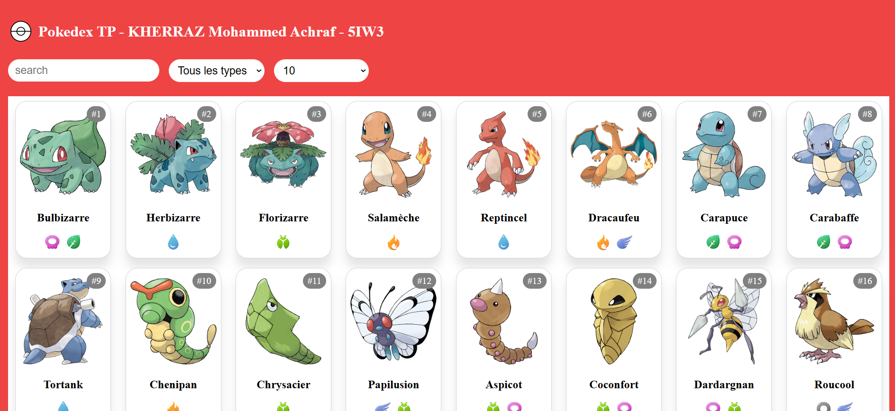
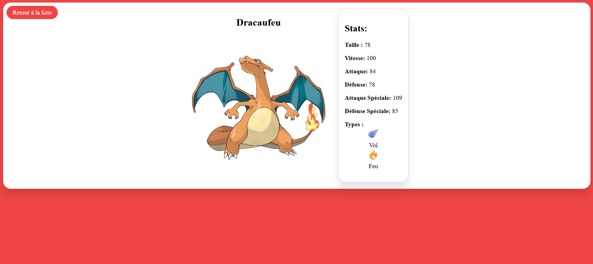

# Pokédex React App

Une application **Pokédex** développée avec **React**, qui consomme les données des Pokémon via l'API [NestJS Pokedex API](https://nestjs-pokedex-api.vercel.app/pokemons).

## 🚀 Fonctionnalités

- Liste complète des Pokémon avec images.
- Affichage des détails d'un Pokémon, incluant :
  - Nom, types, image officielle.
  - Statistiques (HP, Attaque, Défense, etc.).
  - Évolutions (si disponibles).
- Recherche de Pokémon par nom.

## 🖼️ Aperçu

### Page d'accueil



### Détails d'un Pokémon



## 🛠️ Technologies utilisées

- **React** : Pour la création de l'interface utilisateur.


## 🔧 Installation et utilisation

   ```bash
   git clone 
   npm install
   npm run dev

